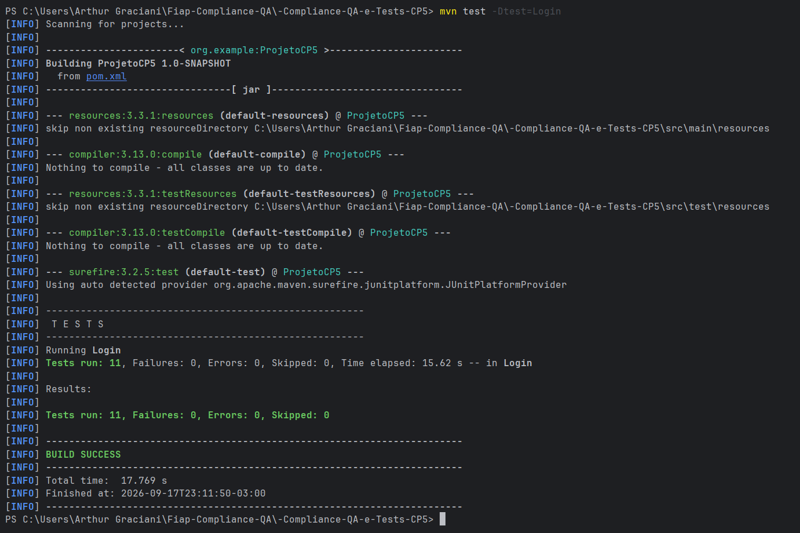

# Checkpoint 5 - Compliance QA e Tests

Suíte de testes automatizados de **login**, construída com **Selenium WebDriver** e **JUnit 5**, aplicada à aplicação de demonstração [saucedemo.com](https://www.saucedemo.com/). Os casos de teste (CT) seguem a notação **Gherkin** (Dado/Quando/E/Então) em comentários e foram desenhados a partir de um plano de compliance que mapeia cada cenário a um código de status HTTP de referência (200, 302, 400, 401, 403, 404, 408, 409, 429, 499, 500).

## Tecnologias

- **Java 21**
- **Maven**
- **Selenium WebDriver 4.49.0**
- **JUnit 5 (Jupiter) 6.1.3**
- **ChromeDriver** (gerenciado automaticamente pelo Selenium Manager)

## Estrutura do projeto

```
src/
├── main/java/org/example/Main.java   # Classe de exemplo gerada pelo template do projeto
└── test/java/Login.java              # Suíte de testes de login (CT1 a CT11)
```

## Como executar

Pré-requisitos: JDK 21 e Google Chrome instalados.

```bash
mvn test -Dtest=Login
```

> Cada teste abre e fecha sua própria instância do Chrome (`@BeforeEach`/`@AfterEach`). Como a suíte navega no site real `saucedemo.com`, é necessária conexão com a internet para executá-la.

## Casos de teste

| Caso | Status de referência | Cenário validado |
|------|----------------------|-------------------|
| CT1  | 200 | Login com credenciais válidas redireciona para `inventory.html`. |
| CT2  | 302 | Acesso direto a uma página autenticada sem sessão ativa não expõe o conteúdo protegido. |
| CT3  | 400 | Envio do formulário sem o campo de usuário é rejeitado com mensagem de campo obrigatório. |
| CT4  | 401 | Usuário válido com senha incorreta é rejeitado com mensagem genérica de credenciais inválidas. |
| CT5  | 403 | Conta bloqueada (`locked_out_user`) com credenciais corretas tem o acesso negado. |
| CT6  | 408 | O tempo total de autenticação fica abaixo do limite de 10 segundos definido como requisito não funcional. |
| CT7  | 429 | Três tentativas consecutivas com credenciais erradas continuam sendo rejeitadas de forma consistente. |
| CT8  | 404 | Uma rota inexistente no servidor retorna status HTTP 404 (verificado via requisição HTTP direta). |
| CT9  | 409 | Login simultâneo do mesmo usuário em duas instâncias do navegador evidencia a ausência de controle de sessão única. |
| CT10 | 499 | Atualizar a página antes de confirmar o login evidencia que nenhum dado (nem o e-mail) é retido. |
| CT11 | 500 | Entrada extrema/malformada nos campos não derruba a aplicação; o erro tratado continua sendo exibido normalmente. |

## Sobre a estratégia de testes

O `saucedemo.com` é uma aplicação estática de demonstração, sem backend real de autenticação. Por isso, os cenários de CT6 a CT11 não reproduzem literalmente o código HTTP indicado (que dependeria de infraestrutura como gateway, provedor de identidade externo ou API de autenticação, inexistentes no ambiente). Em vez disso, cada teste valida o comportamento real e observável mais próximo da intenção do cenário original — por exemplo, o CT9 (409 - conflito de sessão) não recebe de fato um HTTP 409, mas comprova, de forma real e executável, que a aplicação **não** implementa controle de sessão única, o que é um achado válido de compliance.

| Nome                    | RM       |
|-------------------------|----------|
| Arthur Graciani Bezerra | RM561728 |

## 📸 Evidências de Execução `mvn test -Dtest=Login`


